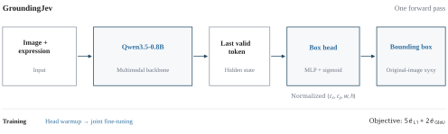
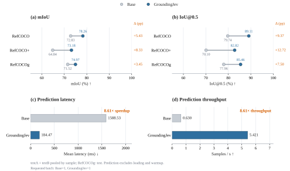

<div align="center">

# GroundingJev

**Jev-inspired Non-autoregressive Visual Grounding**

Qwen3.5-0.8B · ModelScope ms-swift · EvalScope · Docker

[English](README.md) · [简体中文](README_zh.md) · [Model card](MODEL_CARD.md) · [Evaluation](evaluation/README.md)

</div>



## Introduction

Inspired by [TypeSafe Jev](https://typesafe.ai/blog/introducing-system-one-models-and-jev), GroundingJev applies direct, task-specific output prediction to visual grounding.

GroundingJev replaces autoregressive coordinate decoding with continuous bounding-box regression on the Qwen3.5-0.8B multimodal backbone. A lightweight MLP head maps the last valid token's hidden state to normalized `cxcywh` coordinates in a single forward pass.

Training minimizes a weighted L1 and GIoU loss. Head adaptation is followed by joint optimization of the language backbone, visual merger, and regression head; the remaining visual encoder parameters stay frozen.

Training uses ModelScope **ms-swift**, evaluation uses **EvalScope**, and the environment runs in **Docker**. Optional **SwanLab** logging tracks training progress. See [architecture](docs/architecture.md).

## Demos

[Online demo](https://huggingface.co/spaces/xyzzzh/GroundingJev) · [Model weights](https://huggingface.co/xyzzzh/GroundingJev) · [Local inference](docs/inference.md)

## Evaluation results

<!-- RESULTS:START -->
Full test-set results.

RefCOCO and RefCOCO+ pool all testA and testB samples; RefCOCOg uses test.

### mIoU ↑ (%)

| Dataset | Qwen3.5-0.8B | **GroundingJev** | Gain (pp) |
| :--- | ---: | ---: | ---: |
| RefCOCO | 72.83 | **78.26** | +5.43 |
| RefCOCO+ | 64.84 | **73.18** | +8.33 |
| RefCOCOg | 71.52 | **74.97** | +3.45 |

### IoU@0.5 ↑ (%)

| Dataset | Qwen3.5-0.8B | **GroundingJev** | Gain (pp) |
| :--- | ---: | ---: | ---: |
| RefCOCO | 79.74 | **89.11** | +9.37 |
| RefCOCO+ | 70.10 | **82.82** | +12.72 |
| RefCOCOg | 77.96 | **85.46** | +7.50 |

### Inference performance

| Model | Latency ↓ (ms) | Throughput ↑ (samples/s) | Speedup ↑ |
| :--- | ---: | ---: | ---: |
| Qwen3.5-0.8B | 1588.53 | 0.630 | 1.00× |
| GroundingJev | **184.47** | **5.421** | **8.61×** |

**8.61× inference speedup, with 88.39% lower mean latency.**

End-to-end prediction time, excluding model loading and warmup.

Requested batch: Qwen3.5-0.8B=1, GroundingJev=1
<!-- RESULTS:END -->



See [per-split results](evaluation/README.md) and the [evaluation protocol](docs/evaluation.md).

## Quick start

Run the following commands from the repository root with Docker Compose and NVIDIA Container Toolkit installed.

```bash
git clone https://github.com/xyzzzh/GroundingJev.git
cd GroundingJev
```

### 1. Prepare data and install

Download and extract [train2014.zip](https://huggingface.co/datasets/omlab/VLM-R1/blob/main/train2014.zip). Prepare the RefCOCO annotation ZIP, then set `REFCOCO_IMAGES_DIR` in `.env` to the extracted `train2014` directory.

```bash
cp .env.example .env
python scripts/prepare_data.py --archive /path/to/refcoco.zip --output data/refcoco
bash scripts/docker.sh build
bash scripts/docker.sh run --rm groundingjev python scripts/download_model.py
```

The final command downloads the Qwen3.5-0.8B base model. The training file is `refcoco_80k_train.jsonl`. See [data preparation](docs/data.md) for evaluation filenames.

### 2. Train

```bash
bash scripts/train.sh
```

Parameters are in [configs/train/groundingjev.json](configs/train/groundingjev.json). Training writes to `outputs/groundingjev` and exports the model to `models/GroundingJev`. To enable SwanLab, set `SWANLAB_API_KEY` and add `--swanlab`.

### 3. Run inference

To use the published weights directly, skip training and download them:

```bash
bash scripts/docker.sh --eval run --rm groundingjev \
  hf download xyzzzh/GroundingJev --local-dir /models/GroundingJev
```

Run inference:

```bash
bash scripts/infer.sh \
  --image /workspace/datasets/RefCOCO/train2014/your_image.jpg \
  --expression 'the person wearing a red shirt'
```

The result contains the predicted box in original-image pixels.

### 4. Evaluate

```bash
bash scripts/evaluate.sh groundingjev
bash scripts/evaluate.sh base
bash scripts/benchmark.sh
```

Quality evaluation covers RefCOCO, RefCOCO+, and RefCOCOg. The benchmark reports latency and throughput. See the [complete results](evaluation/README.md).

## Contributions

Contributions are welcome. See [CONTRIBUTING.md](CONTRIBUTING.md) for development and submission instructions.

## License and acknowledgments

Project code uses [Apache 2.0](LICENSE). Model weights and datasets retain their respective licenses.

GroundingJev is inspired by [TypeSafe Jev](https://typesafe.ai/blog/introducing-system-one-models-and-jev). We thank [Qwen3.5](https://huggingface.co/Qwen/Qwen3.5-0.8B), [ModelScope ms-swift](https://github.com/modelscope/ms-swift), [EvalScope](https://github.com/modelscope/evalscope), [SwanLab](https://github.com/SwanHubX/SwanLab), and the [COCO](https://cocodataset.org/)/[RefCOCO](https://github.com/lichengunc/refer) authors.
